[TOC]

# ！！！！！前言！！！！！

可以照着此文档搭架前期工作，成功搭建后，直接跳转视频P28学习前端知识

若搭建出现非预期问题，建议观看对应章节的视频


# 环境搭建

## 1.安装virtualbox

```properties
virtualbox下载地址：https://mirror.tuna.tsinghua.edu.cn/help/virtualbox/
```

```java
**步骤：
1.下载安装

2.修改虚拟机默认安装位置，不要放在C盘
	打开virtualbox -> 管理 -> 全局管理 -> Expert -> 常规 -> 默认虚拟电脑位置：D:\VirtualBox VMs
```

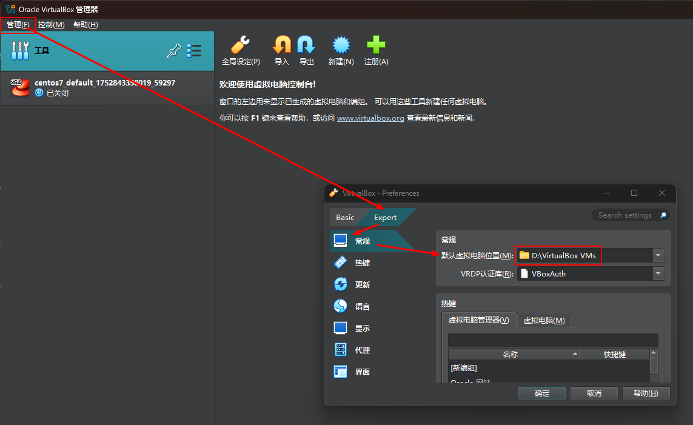

## 2.安装vagrant

[vagrant下载地址]: https://www.vagrantup.com/downloads.html
[vagrant镜像仓库]: https://app.vagrantup.com/boxes/search
[中国科学技术大学镜像仓库]: https://mirrors.ustc.edu.cn/
[vagrant命令集]: https://www.jianshu.com/p/7e8f61376053

```properties
简介:vagrant可以自动拉取镜像并根据镜像快速创建虚拟机，减少了virtualbox的配置

vagrant相关命令：
vagrant up 启动虚拟机
vagrant destroy 销毁虚拟机
vagrant halt 关闭虚拟化开发环境
vagrant reload 修改配置文件后，重启虚拟化开发环境
vagrant box list 查看当前可用的虚拟化开发环境
vagrant box add box-name box-file 添加指定的box环境
vagrant box remove box-name 删除指定的box环境
vagrant package 当前正在运行的VirtualBox虚拟环境打包成一个可重复使用的box
```

### 2.1.创建centos7虚拟机

```properties
**步骤:
1.下载安装vagrant
2.打开命令提示符，输入vagrant -v查看是否安装成功
3.使用vagrant快速创建centos7虚拟机
----------------------------------------------
	方案1，【自动拉取镜像】
		1）打开命令提示符，依次输入以下命令：
		2）初始化虚拟机：vagrant init centos/7【vagrant根据镜像名创建vagrantfile文件】
	    3）启动虚拟机：vagrant up【vagrant根据当前目录的vagrantfile文件配置拉取centos/7镜像】
	    4）连接虚拟机：vagrant ssh
--------------------------------------------
	方案2：【手动下载镜像，速度快，***推荐***】
		1）访问下列网站手动下载centos7镜像文件【选择.VirtualBox.box结尾的镜像】
https://mirrors.ustc.edu.cn/centos-cloud/centos/7/vagrant/x86_64/images/
		2）设置系统变量【默认会在C盘安装虚拟机】：
		          VAGRANT_HOME   D:\VAGRANT_HOME                                         
		3）创建文件夹，用于保存系统镜像、虚拟机配置文件、虚拟机   
				   D:\VAGRANT_HOME\Images
				   D:\VAGRANT_HOME\VagrantFiles
				   D:\VAGRANT_HOME\VagrantFiles\centos7
		
		4）将下载好的centos7.VirtualBox.box镜像文件移动到
		D:\VAGRANT_HOME\Images
		
		5）打开命令提示符，依次执行下列命令启动虚拟机：
		  	cd /d D:\VAGRANT_HOME\Images
		    vagrant box add centos7 CentOS-7-x86_64-Vagrant-2004_01.VirtualBox.box
		    cd /d D:\VAGRANT_HOME\VagrantFiles\centos7
		    vagrant init centos7
		    vagrant up
		          
----------------------------------------------
```

```properties
使用vagrant ssh连接虚拟机可能出现异常：
vagrant@127.0.0.1: Permission denied (publickey,gssapi-keyex,gssapi-with-mic). 错误

错误原因：当前用户没有完全控制权限
解决方法：https://blog.csdn.net/ai_0922/article/details/106366521
```

### 2.2.配置虚拟网络

```sh
1、什么是端口转发：
	默认情况下，虚拟机与主机的通信采用端口转发，例如需要ssh连接虚拟机时，要将一个主机端口（例如2222）与虚拟机的22端口绑定起来，此时通过ssh 127.0.0.1 2222既可以连接虚拟机
	缺点：使用虚拟机中的各种服务时，需要开启许多的端口映射
	
2.什么是虚拟网络：【仅主机（host-only）】
	利用虚拟网卡为虚拟机和主机分别生成独立IP，且两者虚拟IP处于同一网段，主机与虚拟机的通信不再依赖端口映射

3.配置虚拟网络：
	修改vagrantfile配置文件（因为虚拟机是根据这个配置文件启动的）
		1.查看本机虚拟地址：ipconfig （192.168.56.1）
		2.打开配置文件修改地址：config.vm.network "private_network", ip: "192.168.56.10"
		3.重启虚拟机：vagrant reload
		4.验证：ip addr，互相ping
```

端口转发：

 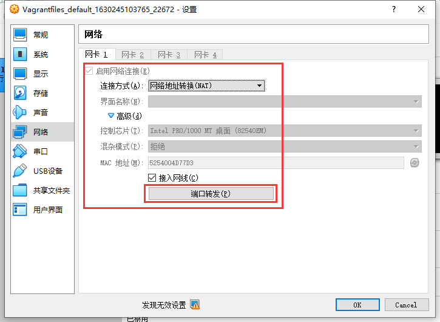

本机虚拟地址：

 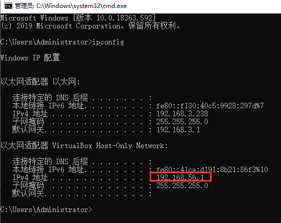

### 2.3.shell工具连接虚拟机

```properties
1.连接：vagrant ssh
2.切换：su root（密码：vagrant）
3.xshell连接 192.168.56.10
	账号密码：vagrant/vagrant
			root/vagrant
5.切换root：su root
```

```properties
常用工具:finalshell、Xshell

可能遇到的问题：
shell工具无法成功连接虚拟机
原因：sshd不允许密码认证
解决方案：
	vagrant ssh
	sudo vi /etc/ssh/sshd_config   
修改参数值为yes: PasswordAuthentication yes

重启服务（或重启虚拟机）:sudo systemctl restart sshd  或（reboot）
再尝试用shell工具连接虚拟机
```

### 2.4.配置网关、DNS

```
【修改网卡相关信息，使得DNS解析正常，否则可能无法拉取docker镜像】

1.查看NAT和host-only分别是哪个网卡:
	ip addr

2.修改NAT和host-only的网卡配置
	cd /etc/sysconfig/network-scripts/
vi ifcfg-eth0       【NAT网卡】
vi ifcfg-eth1		【host-only网卡】

为两个网卡都增加以下三行：
GATEWAY=192.168.56.1
DNS1=114.114.114.114
DNS2=114.114.114.114
DNS3=8.8.8.8

3.重启网卡
sudo service network restart
```

### 2.5.配置yum源加速

```bash
yum常用选项：

    -y：对所有的提问都回答“yes”，自动确认操作。
    -c：指定配置文件。
    -q：安静模式，减少输出信息。
    -v：详细模式，增加输出信息。
    -d：设置调试等级（0-10）。
    -e：设置错误等级（0-10）。
    -R：设置 yum 处理一个命令的最大等待时间。
    -C：完全从缓存中运行，而不去下载或者更新任何头文件。

yum常用命令：

    install：安装指定的软件包。
    update：更新所有已安装的软件包。
    remove：删除指定的软件包。
    search：搜索可用的软件包。
    list：列出所有可安装的软件包。
    check-update：列出所有可更新的软件包。
    clean：清除缓存。

```


```
1.备份原yum源
sudo mv /etc/yum.repos.d/CentOS-Base.repo /etc/yum.repos.d/CentOS-Base.repo.backup

2.使用新yum源（阿里云）
curl -o /etc/yum.repos.d/CentOS-Base.repo http://mirrors.aliyun.com/repo/Centos-7.repo

EPEL源：
curl -o /etc/yum.repos.d/epel.repo http://mirrors.aliyun.com/repo/epel-7.repo


3.生成缓存
yum clean all
yum makecache


4.安装命令行工具
yum -y install wget【用于下载】
yum -y install unzip【用于下载】
```

## 3.安装docker

```properties
简介：
	虚拟化容器技术，docker基于镜像秒级启动各种容器，每一种容器都是一个完整的运行环境（每一个容器可以看做一个完整的linux环境），容器之间相互隔离。
	例如windows中的ghost，根据windwos镜像安装系统（镜像中可能包含其他软件，qq、wx）
	docker利用各种镜像在linux中安装容器（可以根据一个镜像安装多个容器），例如根据mysql镜像多个mysql容器
	docker build
	docker pull
	docker run

docker安装官方文档：https://docs.docker.com/desktop/setup/install/linux/
docker镜像仓库：https://hub.docker.com
```

 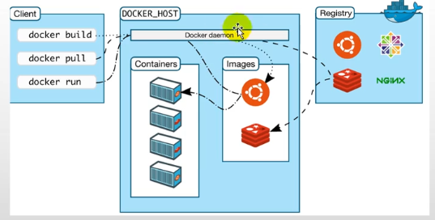

```sh
**步骤：
1.Uninstall old versions（卸载旧版本）：
  yum remove docker \
                  docker-client \
                  docker-client-latest \
                  docker-common \
                  docker-latest \
                  docker-latest-logrotate \
                  docker-logrotate \
                  docker-engine
2.Set up the repository（安装相关依赖）：
  yum install -y yum-utils

3.设置系统环境变量（解决 Locale 警告）
echo "export LC_ALL=en_US.UTF-8" >> /etc/profile
source /etc/profile

添加软件仓库，用于加速安装docker
  yum-config-manager --add-repo http://mirrors.aliyun.com/docker-ce/linux/centos/docker-ce.repo

4.安装docker
 yum install -y docker-ce docker-ce-cli containerd.io

5、启动docker
设置开机自启： systemctl enable docker
启动： systemctl start docker

6、测试
docker -v
```

### 3.1.相关命令

```sh
1、查看已启动镜像：docker images
   查看已运行容器：docker ps
2、查看所有镜像：docker images -a
3、启动docker：sudo systemctl start docker
4、虚拟机开机启动：sudo systemctl enable docker
5、设置自动启动容器：sudo docker update mysql --restart=always
6、启动已存在的容器或重启容器，例：
	1）查看容器的id或name：docker ps -a
	2）重启restart id或name【重启就代表启动了】：
		docker restart 1b4671904bfa
		docker restart mysql
7、终止容器：docker stop redis
8、删除容器：docker rm redis
9、进入容器的运行时环境
进入mysql：docker exec -it mysql /bin/bash
进入redis：docker exec -it redis redis-cli
进入redis：docker exec -it redis /bin/sh
whereis mysql
10、退出容器运行时环境：exit
11、虚拟机开机自动启动mysql容器：sudo docker update mysql --restart=always
```

### 3.2.配置镜像加速器

sudo mkdir -p /etc/docker
sudo tee /etc/docker/daemon.json <<-'EOF'
{
     "registry-mirrors": [
       "https://7zi5cb9i.mirror.aliyuncs.com", 
       "https://docker.1panel.live",
       "https://docker.1ms.run",
       "https://dockerpull.org",
       "https://mirror.baidubce.com",
       "https://hub-mirror.c.163.com",
       "https://mirrors.tuna.tsinghua.edu.cn"
     ],
     "dns": ["223.5.5.5", "8.8.8.8", "114.114.114.114"]
   }  

EOF
sudo systemctl daemon-reload
sudo systemctl restart docker

```sh
作用：下载docker image镜像加速


1.登录阿里云获取镜像地址：【阿里云镜像已部分停用，建议优先使用其他源】
	https://cr.console.aliyun.com/cn-hangzhou/instances/mirrors


sudo mkdir -p /etc/docker
sudo tee /etc/docker/daemon.json <<-'EOF'
{
     "registry-mirrors": [
       "https://7zi5cb9i.mirror.aliyuncs.com", //【替换为自己的阿里云镜像地址】
       "https://docker.1panel.live",
       "https://docker.1ms.run",
       "https://dockerpull.org",
       "https://mirror.baidubce.com",
       "https://hub-mirror.c.163.com",
       "https://mirrors.tuna.tsinghua.edu.cn"
     ],
     "dns": ["8.8.8.8", "114.114.114.114"]
   }  
EOF
sudo systemctl daemon-reload
sudo systemctl restart docker
```

### 3.3.拉取mysql镜像启动容器

```properties
简介：https://hub.docker.com 镜像仓库
	docker pull mysql：		拉取最新版本镜像
	docker pull mysql:5.7 	拉取指定版本镜像
    
navicat12安装：https://cloud.tencent.com/developer/article/1718099

由于找不到MSVCR120.dll,无法继续执行代码.重新安装程序可能会解决此问题：https://blog.csdn.net/burning1996/article/details/100315436
```

```sh
步骤：
1.拉取镜像：
 docker pull mysql:5.7

2.查看已拉取的镜像
docker images

3.启动一个容器【默认密码是root】
mkdir -p /mydata/mysql/conf/conf.d  

docker run -p 3306:3306 --name mysql \
-v /mydata/mysql/log:/var/log/mysql \
-v /mydata/mysql/data:/var/lib/mysql \
-v /mydata/mysql/conf:/etc/mysql/conf.d \
-e MYSQL_ROOT_PASSWORD=root \
-d mysql:5.7

参数说明（下面提到的主机指的是虚拟机）
-p 3306:3306:将容器的3306端口映射到虚拟机的3306端口
--name 当前启动的容器 设置名字
-v /mydata/mysql/conf:/etc/mysql:将主机的配置文件夹挂载到容器
-e MYSQL_ROOT_PASSWORD=root: 初始化root用户的密码
-d 后台启动
mysql:5.7： 该容器所使用的镜像

4、修改root用户访问ip限制
【https://blog.csdn.net/scarecrow__/article/details/81556845】
	1）进入mysql容器：docker exec -it mysql /bin/bash
	2）连入mysql：mysql -uroot -proot
	3）查询：select host,user,plugin,authentication_string from mysql.user;
		找到user为root的两列，将host列修改为%
		执行以下语句：
		ALTER USER 'root'@'%' IDENTIFIED WITH mysql_native_password BY 'root'; 
		【允许远程访问，修改认证方式mysql_native_password，设置密码为root】
		FLUSH PRIVILEGES;  -- 刷新权限，使更改生效

5、远程无法连接mysql：修改root用户远程访问权限""
grant all privileges on *.* to root@"%" identified by "root" with grant option;

6、修改mysql字符集
vi /mydata/mysql/conf/my.cnf

[client]
default-character-set=utf8

[mysql]
default-character-set=utf8
[mysqld]
init_connect='SET collation_connection = utf8_unicode_ci'
init_connect='SET NAMES utf8'
character-set-server=utf8
collation-server=utf8_unicode_ci
skip-character-set-client-handshake
skip-name-resolve

7、重启：docker restart mysql

8、虚拟机开机自动启动mysql容器
	 docker update mysql --restart=always
```

 正确授权配置：

 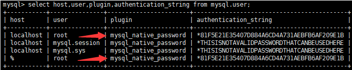

### 3.4.拉取redis镜像启动容器

```properties
简介：
1.redis配置文件：https://raw.githubusercontent.com/redis/redis/6.0/redis.conf
```

```sh
步骤：
1.拉取镜像：docker pull redis

2.坑：使用-v命令挂载时，主机会把redis.conf当做目录创建，所以先将该文件创建好
mkdir -p /mydata/redis/conf
touch /mydata/redis/conf/redis.conf

开启redis持久化：
vi /mydata/redis/conf/redis.conf
	添加配置：	appendonly yes

3.启动容器
docker run -p 6379:6379 --name redis \
-v /mydata/redis/data:/data \
-v /mydata/redis/conf/redis.conf:/etc/redis/redis.conf \
-d redis redis-server /etc/redis/redis.conf

参数说明：
redis-server /etc/redis/redis.conf：容器启动后执行的命令，启动Redis服务器并加载指定配置文件

4、自启动：
docker update redis --restart=always
docker restart redis

---	终止容器：docker stop redis
--- 删除容器：docker rm redis

6、连接redis：
	1）进入容器内部连接：
	docker exec -it redis /bin/bash
	redis-cli -p 6379
	2）使用客户端连接：
	docker exec -it redis redis-cli 
	3）外部windows可视化客户端连接6379端口
```

### 3.5.安装nps（内网穿透服务端）

【如果您有自己的云服务器，则可以搭建nps和npc内网穿透服务，为商城后面的支付功能提供环境】

【如果没有则可以跳过3.5和3.6，后面可以用花生壳代替】

[官方文档]: https://ehang-io.github.io/nps
[github地址]: https://github.com/ehang-io/nps/
[安装教程]: https://www.laobaiblog.top/2022/11/02/docker%E5%AE%89%E8%A3%85nps%E5%AE%9E%E7%8E%B0openwrt%E5%86%85%E7%BD%91%E7%A9%BF%E9%80%8F/

```sh
步骤：
0.使用ssh登录您的云服务器，并安装docker环境

1.拉取nps镜像
docker pull ffdfgdfg/nps

2.创建nps配置文件目录
mkdir -p /mydata/nps/conf

3.访问https://github.com/dreamskr/nps/blob/master/conf/nps.conf下载配置文件，
  将nps-master下的conf文件夹拷贝至云服务器的/mydata/nps/conf目录下

4.启动容器
docker run -d -p 19000-19010:19000-19010 \
-v /mydata/nps/conf:/conf --name=nps \
--restart=always ffdfgdfg/nps
```

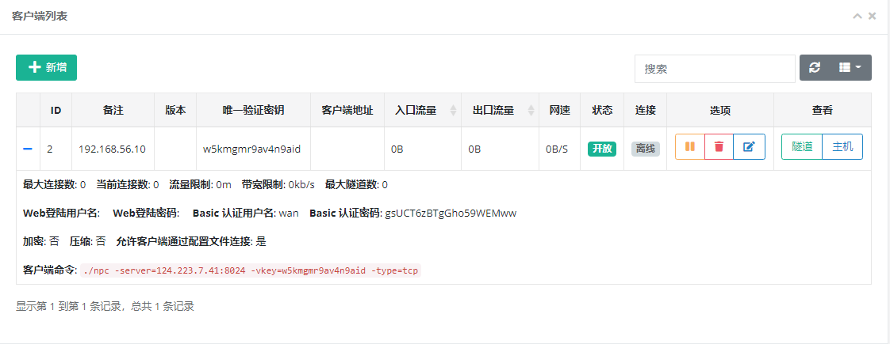

### 3.6.安装npc（内网穿透客户端）

【如果您有自己的云服务器，则可以搭建nps和npc内网穿透服务，为商城后面的支付功能提供环境】

【如果没有则可以跳过3.5和3.6，后面可以用花生壳代替】

```
0.使用ssh登录您的本地Centos虚拟机

1.docker pull ffdfgdfg/npc

2.创建npc配置文件目录
mkdir -p /mydata/npc/conf

3.下载配置文件：https://github.com/dreamskr/nps/blob/master/conf/nps.conf
	将nps-master下的conf文件夹拷贝至服务器上的/mydata/npc/conf目录下

4.浏览器访问nps服务端，新建一个客户端，并记住对应的vkey

5.启动一个npc容器：
	方案1：不需要配置文件的启动方式：
		docker run -d --name npc --net=host ffdfgdfg/npc \
-server=192.168.56.10:19002 -vkey=76dev696z1ai76ar -type=tcp

	方案2：需要配置文件的启动方式（修改配置文件，填入正确的服务器地址、端口、vkey、账号密码等）：
		docker run -d --name npc \
-v /mydata/npc/conf:/conf \
--net=host --restart=always ffdfgdfg/npc
```

## 4.开发环境jdk、maven、idea、vscode

```xml
1.jdk配置
	1）安装jdk1.8
	2）新增1条环境变量
		JAVA_HOME	  D:\Program Files\Java\Jdk\jdk1.8.0_171

2.maven配置：
	1）安装maven3.5.4
	2）新增两条环境变量
		MAVEN_HOME	  D:\Program Files\Java\apache-maven-3.6.3
		Path		  %MAVEN_HOME%\bin
	3）新建本地仓库文件夹：D:\java\apache\repository
	4）打开maven配置文件setting.xml，直接拷贝下列配置粘贴即可
<?xml version="1.0" encoding="UTF-8"?>
<settings xmlns="http://maven.apache.org/SETTINGS/1.0.0"
          xmlns:xsi="http://www.w3.org/2001/XMLSchema-instance"
          xsi:schemaLocation="http://maven.apache.org/SETTINGS/1.0.0 http://maven.apache.org/xsd/settings-1.0.0.xsd">

  <localRepository>D:\java\apache\repository</localRepository>
    <mirrors>
	<mirror>
	    <id>aliyun</id>
	    <name>aliyun Maven</name>
	    <mirrorOf>*</mirrorOf>
	    <url>http://maven.aliyun.com/nexus/content/groups/public</url>
	   <!-- <url>http://maven.oschina.net/content/groups/public</url> -->
        </mirror>
    </mirrors>
	
  <profiles>
    <profile>
      <id>jdk-1.8</id>
      <activation>
		<activeByDefault>true</activeByDefault>
        <jdk>1.8</jdk>
      </activation>
	  <properties>
	    <maven.compiler.source>1.8</maven.compiler.source>
	    <maven.compiler.target>1.8</maven.compiler.target>
	    <maven.compiler.compilerVersion>1.8</maven.compiler.compilerVersion>
      </properties>
    </profile>
  </profiles>
</settings>

3.idea配置
	【参考此网址：https://www.quanxiaoha.com/idea/idea-tutorial.html】
	1）配置编译器的maven环境
	2）配置编译器的jdk环境
	3）下载插件lombok、mybatisx、AI
	4）设置自动导包
	

4.vscode配置
	【下载： https://code.visualstudio.com/ 】
	1）安装vscode
	2）为vscode安装插件，按住键盘ctrl + shift + x -> 在弹出框输入下列插件 -> 依次安装即可

插件列表：
Auto Close Tag
Auto Rename Tag
Chinese
ESLint
HTML CSS Support
HTML Snippets
JavaScript(ES6)
Live Server
open in browser
Vetur
```

环境变量：

 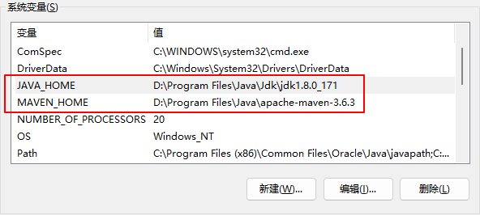

 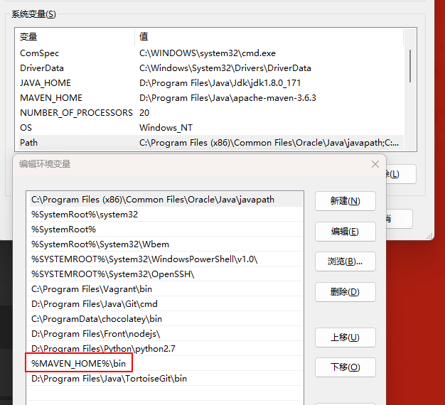


idea配置教程：

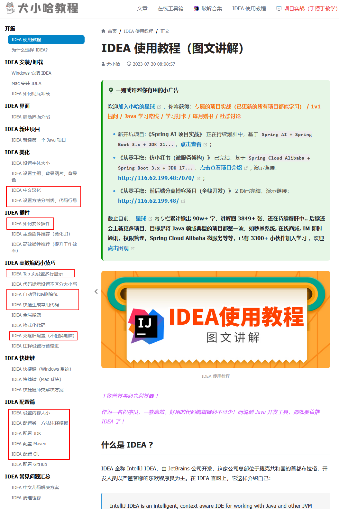


vscode安装插件：

 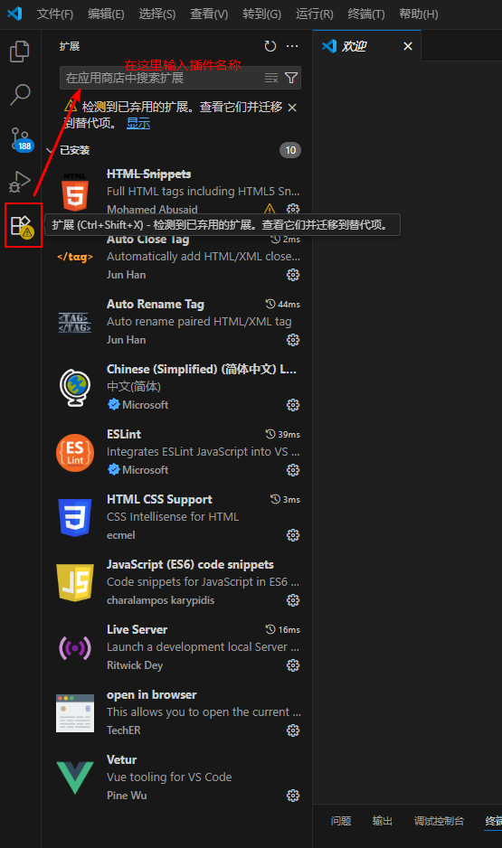

## 5.git配置

```sh
步骤：
1.作者信息
用户名：git config --global user.name "XiaoWan"
邮箱：git config --global user.email "iverson685@163.com"

2.配置ssh登录，提交代码时不用再登录账号密码
	命令提示符输入：ssh-keygen -t rsa -C "iverson685@163.com" 【这里输入的是gitee/github账户】
	输入三次回车
	密钥默认存储路径 C:\Users\Administrator\.ssh\id_rsa.pub
	使用记事本打开密钥文件，复制该秘钥

3.登录gitee或github -> 设置 -> ssh公钥 -> 将上一步复制内容粘贴在此处

4.测试
ssh -T git@gitee.com
```

 

## 6.安装nginx

```sh
1、调整虚拟机内存4G（free -m查看）
2、创建nginx文件夹
	cd /mydata
	mkdir nginx
3、随便启动一个nginx实例，只是为了复制出配置
	docker run -p 80:80 --name nginx -d nginx:1.10
4、将nginx容器内的配置文件拷贝到当前目录（当前目录在/mydata，此处运行一下命令）：
【别忘了后面的点】
	docker container cp nginx:/etc/nginx .
5、终止原容器:docker stop nginx
6、删除原容器:docker rm nginx
7、修改当前nginx文件名字为conf：mv nginx conf
8、创建nginx文件夹：mkdir nginx
9、移动conf到nginx文件夹中：mv conf nginx/
10、创建新的nginx容器：
docker run -p 80:80 --name nginx --restart=always \
-v /mydata/nginx/html:/usr/share/nginx/html \
-v /mydata/nginx/logs:/var/log/nginx \
-v /mydata/nginx/conf:/etc/nginx \
-d nginx:1.10

11、测试，在html文件夹下创建index.html：
tee /mydata/nginx/html/index.html <<-'EOF'
<h1>test</h1>
EOF


然后访问：192.168.56.10
```


# 项目搭建

```
坑：
1.idea2018用不了maven3.6，换成3.4
https://blog.csdn.net/weixin_39723544/article/details/101066414 
```

```xml
主模块步骤：
1.登录gitee，创建git项目，见下图


2.打开idea，使用git拉取项目
New -> Project from version Control -> https://gitee.com/wananw/gulimall.git

3.创建主项目pom文件：gulimall.pom
<?xml version="1.0" encoding="UTF-8"?>
<project xmlns="http://maven.apache.org/POM/4.0.0" xmlns:xsi="http://www.w3.org/2001/XMLSchema-instance"
         xsi:schemaLocation="http://maven.apache.org/POM/4.0.0 https://maven.apache.org/xsd/maven-4.0.0.xsd">
    <modelVersion>4.0.0</modelVersion>
    <groupId>com.atguigu.gulimall</groupId>
    <artifactId>gulimall</artifactId>
    <version>0.0.1-SNAPSHOT</version>
    <name>gulimall</name>
    <description>聚合服务</description>
    <packaging>pom</packaging>

    <modules>
        <module>gulimall-coupon</module>
        <module>gulimall-member</module>
        <module>gulimall-order</module>
        <module>gulimall-product</module>
        <module>gulimall-ware</module>
    </modules>
</project>

4.右键gulimall.pom文件，点击设置为maven项目

5.配置.gitignore
target/
pom.xml.tag
pom.xml.releaseBackup
pom.xml.versionsBackup
pom.xml.next
release.properties
dependency-reduced-pom.xml
buildNumber.properties
.mvn/timing.properties
# https://github.com/takari/maven-wrapper#usage-without-binary-jar
.mvn/wrapper/maven-wrapper.jar

**/mvnw
**/mvnw.cmd
**/.mvn
**/target/
.idea
**/.gitignore
HELP.md
```

git新建仓库： 


设置好.gitignore后，将unversioned File加入版本控制 add to VCS

 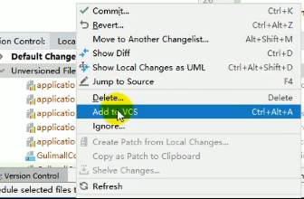

## 1.创建子项目

```xml
D:\Program Files\Java\Jdk\jdk1.8.0_171

1.创建5个Spring Initializr子module，
【更换spring boot服务器URL地址：https://start.aliyun.com，否则java无法选择低版本8】
Group：com.atguigu.gulimall
artifact：gulimall-coupon
		  gulimall-member
		  gulimall-order
		  gulimall-product
		  gulimall-ware
type：maven
description：
			谷粒商城-优惠券服务【表：gulimall_sms】
			谷粒商城-会员服务【表：gulimall_ums】
			谷粒商城-订单服务【表：gulimall_oms】
			谷粒商城-商品服务【表：gulimall_pms】
			谷粒商城-仓储服务【表：gulimall_wms】
			
package：com.atguigu.gulimall.coupon
		 com.atguigu.gulimall.member
		 com.atguigu.gulimall.order
		 com.atguigu.gulimall.product
		 com.atguigu.gulimall.ware


选中需要导入的依赖：
Web：Spring Web
Spring Cloud Routing：OpenFeign
【注：project configuration files can be added：先不点，配置好.gitignore】

2.修改springboot+springcloud的版本，否则可能会报错
    <parent>
        <groupId>org.springframework.boot</groupId>
        <artifactId>spring-boot-starter-parent</artifactId>
        <version>2.3.2.RELEASE</version>
        <relativePath/> <!-- lookup parent from repository -->
    </parent>

    <properties>
        <java.version>1.8</java.version>
        <spring-cloud.version>Hoxton.SR6</spring-cloud.version>
    </properties>


打开 Settings > Build, Execution, Deployment > Build Tools > Maven > Runner。
在 VM Options 中添加 
	-DskipTests【跳过测试执行，但会编译测试类】或
	-Dmaven.test.skip=true 【完全跳过测试代码的编译和执行, 后期需要测试时请删除该参数】 
构建：   mvn clean install -U
```

 

### 1.2.优化mvn指令速度

```
maven\runner\vm options：-Dmaven.test.skip=true

线程计数：10C
```


## 2.数据库初始化（powerdisigner）

```
简介：
	使用powerdisigner根据数据库设计创建出建表语句
```

```
步骤：
	1、database->generate Database->preview：可以预览所有表创建的sql语句
	2、使用数据库客户端创建数据库 gulimall_pms、gulimall_oms、gulimall_sms、gulimall_ums、gulimall_wms
	3、使用数据库客户端创建数据库 -> 右键数据库 -> 运行SQL语句 -> 执行上个步骤生成的sql
```

 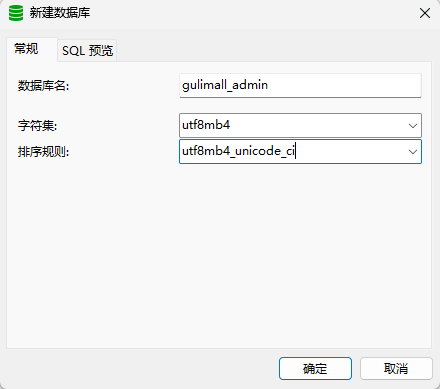

 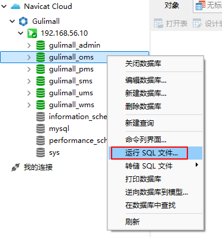

## 3.后台管理系统-renren前后端

```
简介：
	使用人人开源作为后台管理系统，git上搜索人人开源
git clone https://gitee.com/renrenio/renren-fast.git
git clone https://gitee.com/renrenio/renren-fast-vue.git
```


### 3.1.renren-fast（后端）

```yml
1.clone到gulimall项目中，并删除.git文件
2.gulimall的pom文件配置该renren-fast模块
	<module>renren-fast</module>
3.创建数据库gulimall-admin（基于db.mysql.sql文件）
4.修改配置文件
application-dev.yml
	driver-class-name: com.mysql.cj.jdbc.Driver
    url: jdbc:mysql://192.168.56.10:3306/gulimall_admin?useUnicode=true&characterEncoding=UTF-8&serverTimezone=Asia/Shanghai
    username: root
    password: root
```

### 3.2.renren-fast-vue（前端）

```sh
1.下载安装node.js【版本10.16.3】
	官网：https://nodejs.org/en/
	所有版本msi镜像：https://nodejs.org/dist/
	安装完成后检查：cmd-> node -v

2.拉取前端项目：git clone https://gitee.com/renrenio/renren-fast-vue.git
	管理员身份打开vs-code编译器
	使用vs-code打开renren-fast-vue项目
	
3.安装python
	https://www.onlinedown.net/soft/1165640.htm
	配置系统环境变量 PATH：D:\Program Files\python2.7

4.如果有科学上网环境，为npm添加代理，保证资源成功下载
	npm config set proxy http://127.0.0.1:7890

5.启动项目
	npm install
	npm run dev
```

```properties
异常处理：
	如果安装chromedriver失败，使用以下方法：
	手动下载chromedriver：https://mirrors.huaweicloud.com/chromedriver/2.27/chromedriver_win32.zip
	
	解压到npm缓存目录："C:\Users\wananw\AppData\Local\Temp\chromedriver\"
	
	设置环境变量强制使用本地文件
	$env:CHROMEDRIVER_SKIP_DOWNLOAD = "true"
	$env:CHROMEDRIVER_FILEPATH = "C:\Users\wananw\AppData\Local\Temp\chromedriver\chromedriver.exe"
	
	# 先安装 node-sass（使用华为镜像）
npm install node-sass --sass_binary_site=https://mirrors.huaweicloud.com/node-sass/ --registry=https://mirrors.huaweicloud.com/repository/npm/

	# 使用华为镜像执行安装
npm install --registry=https://mirrors.huaweicloud.com/repository/npm/ --ignore-scripts

	运行项目
    npm run dev
```

## 4.创建公共模块gulimall-common

```xml
1.创建
new module->maven->artifactid:gulimall-common->module name：gulimall-common

2.各子模块引入common
        <dependency>
            <groupId>com.atguigu.gulimall</groupId>
            <artifactId>gulimall-common</artifactId>
            <version>0.0.1-SNAPSHOT</version>
        </dependency>

3.在common中加入公共依赖
        <!--从renren-fast拷贝-->
        <!--mybatis plus-->
        <dependency>
            <groupId>com.baomidou</groupId>
            <artifactId>mybatis-plus-boot-starter</artifactId>
            <version>3.3.2</version>
        </dependency>
        <!--lombok-->
        <dependency>
            <groupId>org.projectlombok</groupId>
            <artifactId>lombok</artifactId>
            <version>1.18.12</version>
        </dependency>
        <!--Query用到StringUtils-->
        <dependency>
            <groupId>org.apache.commons</groupId>
            <artifactId>commons-lang3</artifactId>
            <version>3.7</version>
        </dependency>
        <dependency>
            <groupId>commons-beanutils</groupId>
            <artifactId>commons-beanutils</artifactId>
            <version>1.9.3</version>
        </dependency>
        <dependency>
            <groupId>commons-lang</groupId>
            <artifactId>commons-lang</artifactId>
            <version>2.6</version>
        </dependency>
        <!--R中用到的 发送HTTP请求-->
        <dependency>
            <groupId>org.apache.httpcomponents</groupId>
            <artifactId>httpcore</artifactId>
            <version>4.4.13</version>
        </dependency>
        <!--servlet-->
        <dependency>
            <groupId>javax.servlet</groupId>
            <artifactId>servlet-api</artifactId>
            <version>2.5</version>
            <scope>provided</scope>
        </dependency>
        <!--HttpUtils需要的所有依赖-->
        <dependency>
            <groupId>com.alibaba</groupId>
            <artifactId>fastjson</artifactId>
            <version>1.2.15</version>
        </dependency>
        <dependency>
            <groupId>org.apache.httpcomponents</groupId>
            <artifactId>httpclient</artifactId>
            <version>4.2.1</version>
        </dependency>

4.拷贝renren-fast中下图所示类到common模块中
com.atguigu.common
	exception
	utils
	xss
```

  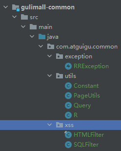

## 5.renren-generator逆向生成工具

```java
前言
1、renren-generator的作用是为各模块逆向生成controller、service、entity类，减少认为重复编码量
2、以下步骤需重复五次，依次为product、member、coupon、order、ware模块生成对应的代码
```


```properties
步骤：
1.克隆代码到gulimall项目文件夹中
git clone https://gitee.com/renrenio/renren-generator.git

2.配置pom
<module>renren-generator</module>

3.配置application.yml
# mysql
spring:
  datasource:
    type: com.alibaba.druid.pool.DruidDataSource
    #MySQL配置
    driverClassName: com.mysql.cj.jdbc.Driver
    url: jdbc:mysql://192.168.56.10:3306/gulimall_pms?useUnicode=true&characterEncoding=UTF-8&useSSL=false&serverTimezone=Asia/Shanghai
    username: root
    password: root
	
4.配置generator.properties
#代码生成器，配置信息

mainPath=com.atguigu
#包名
package=com.atguigu.gulimall
moduleName=product
#作者
author=wanzenghui
#Email
email=lemon_wan@aliyun.com
#表前缀(类名不会包含表前缀)【java bean会去掉表前缀创建bean类】
tablePrefix=pms_

5.修改generator生成模板
	注释掉renren-generator -> resources -> template以下语句:
	// import org.apache.shiro.authz.annotation.RequiresPermissions;
	// @RequiresPermissions

6.运行，访问localhost，选中所有表，点击生成代码
	
	
7.下载解压
	将main文件整个拷贝到模块中
	删除生成的vue代码
	将mapper文件拷贝到模块中

8.以上步骤重复5次
```

复制后效果图：

 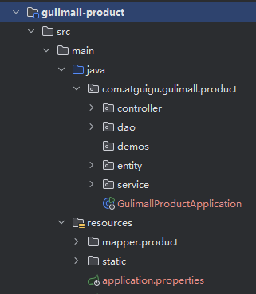

## 6.整合mybatisplus

[MySQL与驱动版本对应表]: https://dev.mysql.com/doc/connector-j/8.0/en/connector-j-versions.html

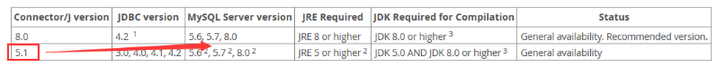

```java
步骤：
1、整合mybatis-plus
	1）common模块导入依赖
		<!--mybatisplus-->
        <dependency>
            <groupId>com.baomidou</groupId>
            <artifactId>mybatis-plus-boot-starter</artifactId>
            <version>3.3.2</version>
        </dependency>
    
    2）代码层面整合【参照文档：https://mp.baomidou.com/guide/config.html】
		1、配置驱动，在common模块导入数据库驱动依赖【我的mysql版本是5.7.31，对应8.0驱动】
                <dependency>
                    <groupId>mysql</groupId>
                    <artifactId>mysql-connector-java</artifactId>
                    <version>8.0.17</version>
                </dependency>
        2、【重复5次！】为各模块配置数据源
            创建配置文件 application.yml
                spring:
                  datasource:
                    username: root
                    password: root
                    url: jdbc:mysql://192.168.56.10:3306/gulimall_pms?useUnicode=true&characterEncoding=UTF-8&useSSL=false&serverTimezone=Asia/Shanghai
                    driver-class-name: com.mysql.cj.jdbc.Driver

        3、【重复5次！】在各模块的Application启动类上添加注解
                @MapperScan("com.atguigu.gulimall.product.dao")
                @MapperScan("com.atguigu.gulimall.order.dao")
                @MapperScan("com.atguigu.gulimall.member.dao")
                @MapperScan("com.atguigu.gulimall.coupon.dao")
                @MapperScan("com.atguigu.gulimall.ware.dao")
			
                        
        4、【重复5次！】在各模块的application.yml中配置Dao.xml的映射路径
                mybatis-plus:
                  mapper-locations: classpath:/mapper/**/*.xml # 扫描本模块和引用模块
                  global-config:
                    db-config:
                      id-type: auto # 主键自增               
```

### 6.1.逻辑删除

```yml
方案一：全局配置
1）配置相关逻辑删除规则
2）配置相关组件（3.1.2后可省略）
mybatis-plus:
  #  扫描依赖的jar包下的所有mapper.xml
  mapper-locations: classpath:/mapper/**/*.xml
  global-config:
    db-config:
      id-type: auto
      -- logic-delete-field: showStatus  # 全局逻辑删除的实体字段名【注：这个不要配，否则所有表都生效】
      # 逻辑删除值(默认为 1)
      logic-delete-value: 1
      # 逻辑不删除值(默认为 0)
      logic-not-delete-value: 0
      
方案二：
/**
* 该值会覆盖全局配置
*/
@TableLogic(value = "1", delval = "0")//value：默认逻辑未删除值；delval：默认逻辑删除值
private Integer showStatus;
```


## 7.其他配置

```java
1.各模块端口分配【coupon：7000、member：8000、order：9000、product：10000、ware：11000】
server:
	port: 7000

2.启动所有服务【如果出现端口占用，在CMD中以下命令解决】
	netstat -ano 查出端口对应的进程ID=》PID，打开控制台关闭
	netstat -ano|findstr "13048" 找到对应的进程，在任务管理器里面关闭进程

3.测试接口
localhost:7000/coupon/coupon/list

4.测试持久层
@RunWith(SpringRunner.class)
@SpringBootTest
class GulimallProductApplicationTests {

    @Autowired
    BrandService brandService;
    
    @Test
    void contextLoads() {
        BrandEntity entity = new BrandEntity();
        entity.setName("华为");
        boolean save = brandService.save(entity);
        System.out.println("保存成功：" + save);
    }
    // 查询条件Wrapper，brand_id = 1的，链式编程拼接多个条件
    @Test
    void queryPage() {
        //brandService.queryPage()
        List<BrandEntity> list = brandService.list(new QueryWrapper<BrandEntity>().eq("brand_id", 1L));
        list.forEach((item)->{
            System.out.println(item);
        });
    }
}
```

## 8.日志级别

```yml
日志级别使用debug，控制台打印sql语句

logging:
  level:
    com.atguigu.gulimall: debug
```

# 分布式环境搭建

## 搭配方案

```properties
注册中心（服务发现/注册）：SpringCloud Alibaba - Nacos【代替Eureka、config】
配置中心（动态配置管理）：SpringCloud Alibaba - Nacos
负载均衡：SpringCloud - Ribbon
声明式HTTP客户端（调用远程服务）：SpringCloud - OpenFeign【代替Feign】
服务容错（限流、降级、熔断）：SpringCloud Alibaba - Sentinel【代替Hystrix】
网关：SpringCloud - GateWay【webflux编程模式，代替zuul】
调用链监控：SpringCloud - Sleuth
分布式事务解决方案：SpringCloud Alibaba - Seata【原Fescar】

SpringCloud Alibaba文档：
https://github.com/alibaba/spring-cloud-alibaba/blob/master/README-zh.md
```

## 1.spring-cloud-alibaba依赖

```xml
在common模块配置依赖：
<dependencyManagement>
    <dependencies>
        <dependency>
            <groupId>org.springframework.cloud</groupId>
            <artifactId>spring-cloud-dependencies</artifactId>
            <version>${spring-cloud.version}</version>
            <type>pom</type>
            <scope>import</scope>
        </dependency>
        <dependency>
            <groupId>com.alibaba.cloud</groupId>
            <artifactId>spring-cloud-alibaba-dependencies</artifactId>
            <version>2.2.1.RELEASE</version>
            <type>pom</type>
            <scope>import</scope>
        </dependency>
    </dependencies>
</dependencyManagement>
```

## 2.Nacos服务注册发现

```properties
nacos——demo：
https://github.com/alibaba/spring-cloud-alibaba/blob/master/spring-cloud-alibaba-examples/nacos-example/nacos-discovery-example/readme-zh.md
```

```yaml
1.在common模块配置依赖：
<!--服务注册发现-->
<dependency>
    <groupId>com.alibaba.cloud</groupId>
    <artifactId>spring-cloud-starter-alibaba-nacos-discovery</artifactId>
</dependency>

2.下载服务端
https://github.com/alibaba/nacos/releases/tag/1.3.1
下载完成运行 startup.cmd

3.在各子模块添加nacos服务端ip+port，并配置各模块服务名【不配置名字nacos服务端服务列表不会显示】
spring:
  cloud:
    nacos:
      discovery:
        server-addr: 127.0.0.1:8848
  application:
    name: gulimall-coupon
    
4.各模块启动类配置注解，作为客户端
@EnableDiscoveryClient

5.查看注册情况【账号/密码：nacos/nacos】
http://127.0.0.1:8848/nacos
```

## 3.OpenFeign声明式远程调用

```properties
简介：
	Feign是一个声明式的HTTP客户端，目的就是让远程调用更加简单
	Feign提供了HTTP请求的模板，通过编写简单的接口和插入注解，就可以定义好HTTP请求的参数、格式、地址等信息
	Feign整合了Ribbon (负载均衡)和Hystrix(服务熔断)，可以让我们不再需要显式地使用这两个组件。


流程分析：
	1.启动类加上两个注解【1.添加当前项目到注册中心；2.开启远程调用】
	2.@FeignClient定义被调用服务名
	3.feign从注册中心拉取服务
	4.负载均衡找到真正的ip+port
	5.搭配方法上@RequestMapping指定的请求路径访问指定controller
```

```java
步骤：
    
1.在gulimall-coupon模块创建以下方法
@RestController
@RequestMapping("coupon/coupon")
public class CouponController {
    @Autowired
    private CouponService couponService;
    
    /**
     * feign调用测试接口
     *
     * @return R
     */
    @RequestMapping("/member/list")
    public R memberList() {
        System.out.println("feign调用测试接口 ---- ");
        CouponEntity entity = new CouponEntity();
        entity.setCouponName("满100减10");
        return R.ok().put("coupons", Collections.singletonList(entity));
    }
}

2.gulimall-common导入依赖
        <dependency>
            <groupId>org.springframework.cloud</groupId>
            <artifactId>spring-cloud-starter-openfeign</artifactId>
        </dependency>

    
3.gulimall-member模块增加接口测试类
package com.atguigu.gulimall.member.feign;

import org.springframework.cloud.openfeign.FeignClient;

@FeignClient("gulimall-coupon")
public interface CouponFeignService {
    /**
     * 测试openFeign，远程调用方法
     */
    @RequestMapping("/coupon/coupon/member/list")
    public R memberList();
}

    
4.gulimall-member开启远程调用，在启动类上添加以下注解
    【spring启动后会扫描指定路径下的所有被@FeignClient修饰的接口】
    
// 开启feign，指定feign接口包地址
@EnableFeignClients(basePackages="com.atguigu.gulimall.member.feign")

    
5.gulimall-member新增测试接口
@RestController
@RequestMapping("member/member")
public class MemberController {
    @Autowired
    private MemberService memberService;

    @Autowired
    private CouponFeignService couponFeignService;

    /**
     * openFeign测试接口
     */
    @RequestMapping("/coupons")
    public R test() {
        return R.ok().put("coupons", couponFeignService.memberList().get("coupons"));
    }
}

6.访问测试请求
http://localhost:8000/member/member/coupons
```

效果图：

 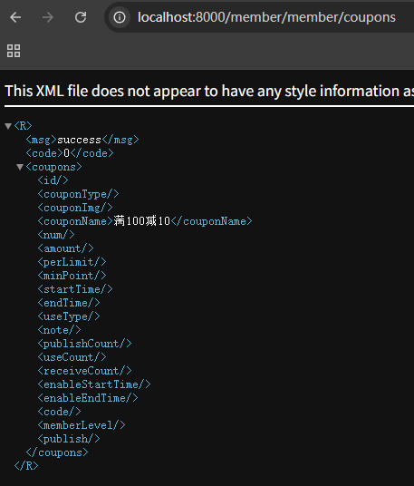

## 4.Nacos Config配置管理

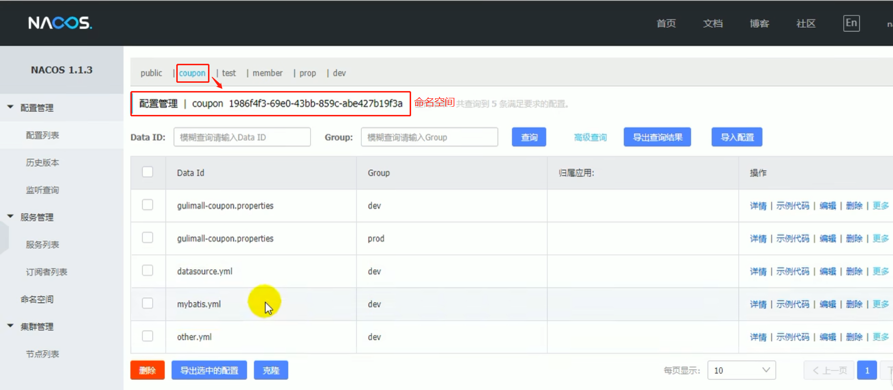

```
简介：
	demo：https://github.com/alibaba/spring-cloud-alibaba/blob/master/spring-cloud-alibaba-examples/nacos-example/nacos-config-example/readme-zh.md
	不使用配置管理的劣势：集群环境下需要修改配置后重新打包并发布
	使用配置管理的优势：无需打包、发布，在nacos配置中心发布配置即可
	
	服务启动后，会根据命名空间、分组、Data ID
	
	1）命名空间
	作用：nacos中为每一个服务分配一个命名空间，各服务在bootstrap.properties中配置命名空间，实现配置隔离
	默认：public
	spring.cloud.nacos.config.namespace=d063e9c5-6e7e-4c7c-8589-bc5f42ecbb6b
	
	2）分组
	作用：每个命名空间下可有多个分组
	默认：DEFAULT_GROUP
	使用：dev、test、prop
	
	3）数据集Data Id：类似文件名【默认 服务名.properties】
	默认：gulimall-product.properties
	服务启动后，控制台会打印nacos配置拉取列表
	例：Located property source: [BootstrapPropertySource 
	{name='bootstrapProperties-gulimall-product.properties,dev'}, BootstrapPropertySource 	  {name='bootstrapProperties-gulimall-product,dev'}, BootstrapPropertySource     		{name='bootstrapProperties-spring.yml,dev'}, BootstrapPropertySource  		 			{name='bootstrapProperties-mybatis.yml,dev'}, BootstrapPropertySource 					{name='bootstrapProperties-datasource.yml,dev'}]

	4）配置集extension-configs
	作用：一组配置文件共同生效，拆分gulimall-product.properties内的配置放在不同的配置文件中
	注意：属性名相同的配置以gulimall-product.properties为主
	使用：将gulimall-product.properties配置拆分至多个配置文件中
					mybatis.yml、datasource.yml、other.yml
```

```properties
步骤：
1.在common模块中导入依赖：
 <dependency>
     <groupId>com.alibaba.cloud</groupId>
     <artifactId>spring-cloud-starter-alibaba-nacos-config</artifactId>
 </dependency>

访问127.0.0.1:8848/nacos完成以下新增动作

2.新建命名空间：product

3.选中命名空间product，新增配置集并指定分组dev【属性名相同的配置以gulimall-product.properties为主】
Data ID：mybatis.yml
Group：dev

Data ID：datasource.yml
Group：dev

Data ID：spring.yml
Group：dev

4.新增配置文件：/src/main/resources/bootstrap.properties【会比application.properties先被加载】
	1.指定Nacos配置中心的server-addr
	2.指定当前服务服务名【否则不会在注册中心中显示】
	3.指定命名空间【未指定，使用默认public】
	4.指定分组【未指定，使用默认DEFAULT_GROUPS   Data Id=gulimall-coupon的文件】
	5.开启热发布热加载【默认开启】
	6.指定配置集【多个yml】
	
spring.cloud.nacos.config.server-addr=127.0.0.1:8848

#服务启动后从nacos拉取配置：gulimall-product.properties,dev、 gulimall-product,dev配置
spring.application.name=gulimall-product
spring.cloud.nacos.config.namespace=d063e9c5-6e7e-4c7c-8589-bc5f42ecbb6b
spring.cloud.nacos.config.group=dev

#服务启动后从nacos拉取配置：spring.yml,dev、 mybatis.yml,dev、 datasource.yml,dev
spring.cloud.nacos.config.extension-configs[0].data-id=datasource.yml
spring.cloud.nacos.config.extension-configs[0].group=dev
spring.cloud.nacos.config.extension-configs[0].refresh=true

spring.cloud.nacos.config.extension-configs[1].data-id=mybatis.yml
spring.cloud.nacos.config.extension-configs[1].group=dev
spring.cloud.nacos.config.extension-configs[1].refresh=true

spring.cloud.nacos.config.extension-configs[2].data-id=spring.yml
spring.cloud.nacos.config.extension-configs[2].group=dev
spring.cloud.nacos.config.extension-configs[2].refresh=true

5.在需要热加载的配置类上添加注解
作用：nacos配置中心发布配置后，@Value标注的属性值会被热加载
@RefreshScope
```

新建配置：

 

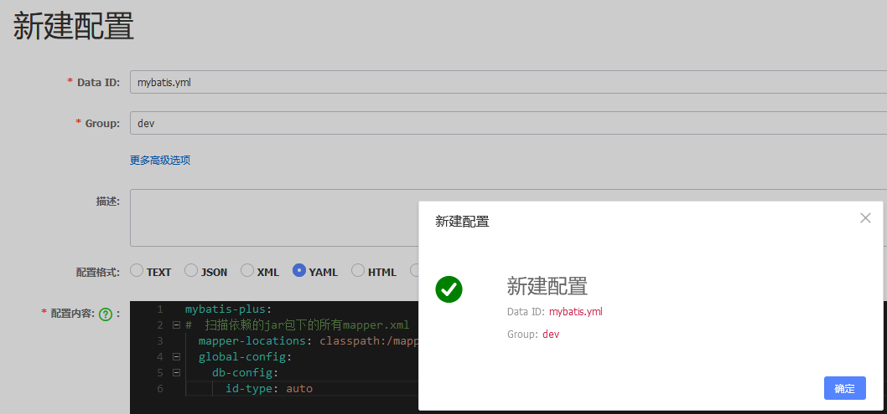

## 5.Gateway网关

```properties
简介：
	路由：将访问网关的url转换为正确的ip+port（集群），并且能感知服务的上线和熔断【否则需要在前端来改端口+ip】
	过滤
	监控
	鉴权
	限流
	日志输出，避免各模块重复代码
	springcloud Gateway比zuul（Netflix）更优秀
	
	doc文档，查看GA稳定版
https://docs.spring.io/spring-cloud-gateway/docs/2.2.4.RELEASE/reference/html/
中文文档：https://www.springcloud.cc/spring-cloud-greenwich.html#gateway-starter

	gateway网关三个概念：【断言成功后跳转路由指定url】
		路由：路由之间通过ID区分 + 一个目的地URI + 断言集合组成 +　过滤器
		断言：条件判断，根据请求参数／请求头等进行判断，为true通过【查看官方文档有哪些断言】
		过滤器：请求之前/响应之后 可以进行过滤，【查看官方文档有哪些过滤器】
```

**各模块之间关系：**

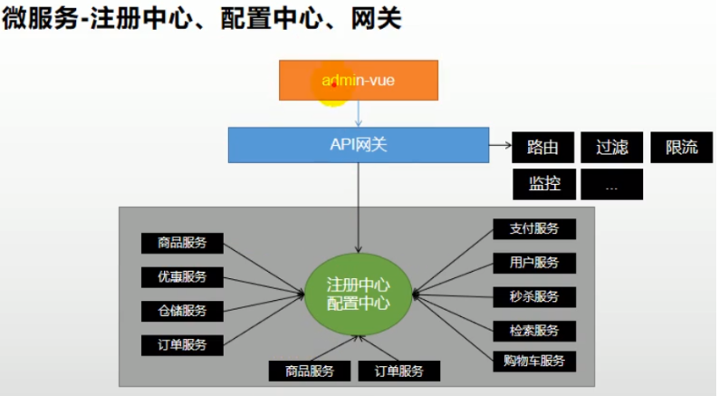

**每秒处理请求次数：**

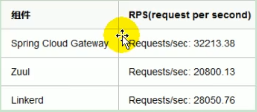

**网关处理过程：**

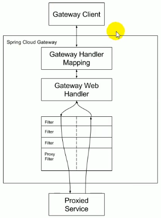

**demo1：**条件：放行某时间点之后的请求

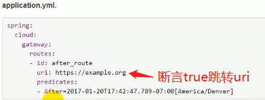

**demo2：**过滤器：要求请求头携带参数 key:X-Request-Foo，value：Bar

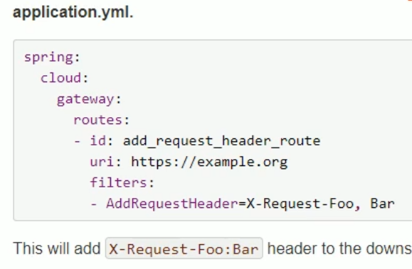

```properties
步骤：
1.创建Spring Init网关模块
com.atguigu.gulimall
gulimall-gateway
com.atguigu.gulimall.gateway

2.修改gulimall-gateway的pom.xml
【需要移除gulimall-common中的数据源依赖，否则启动报错。或者在启动类上增加注解@SpringBootApplication(exclude = {DataSourceAutoConfiguration.class})】
  
<?xml version="1.0" encoding="UTF-8"?>
<project xmlns="http://maven.apache.org/POM/4.0.0" xmlns:xsi="http://www.w3.org/2001/XMLSchema-instance"
         xsi:schemaLocation="http://maven.apache.org/POM/4.0.0 https://maven.apache.org/xsd/maven-4.0.0.xsd">
    <modelVersion>4.0.0</modelVersion>

    <parent>
        <groupId>org.springframework.boot</groupId>
        <artifactId>spring-boot-starter-parent</artifactId>
        <version>2.3.2.RELEASE</version>
    </parent>

    <groupId>com.atguigu.gulimall</groupId>
    <artifactId>gulimall-gateway</artifactId>
    <version>0.0.1-SNAPSHOT</version>
    <name>gulimall-gateway</name>
    <description>谷粒商城-网关服务</description>
    <properties>
        <java.version>1.8</java.version>
        <gulimall-common.version>0.0.1-SNAPSHOT</gulimall-common.version>
        <spring-cloud-starter-gateway.version>2.2.3.RELEASE</spring-cloud-starter-gateway.version>
        <spring-cloud-alibaba-sentinel-gateway.version>2.2.1.RELEASE</spring-cloud-alibaba-sentinel-gateway.version>
        <spring-cloud.version>Hoxton.SR6</spring-cloud.version>
        <spring-cloud-alibaba.version>2.2.1.RELEASE</spring-cloud-alibaba.version>
    </properties>

    <dependencies>
        <!--公共模块-->
        <dependency>
            <groupId>com.atguigu.gulimall</groupId>
            <artifactId>gulimall-common</artifactId>
            <version>${gulimall-common.version}</version>
            <exclusions>
                <exclusion>
                    <groupId>com.baomidou</groupId>
                    <artifactId>mybatis-plus-boot-starter</artifactId>
                </exclusion>
                <exclusion>
                    <groupId>org.springframework.cloud</groupId>
                    <artifactId>spring-cloud-sleuth-zipkin</artifactId>
                </exclusion>
            </exclusions>
        </dependency>
        <!--网关-->
        <dependency>
            <groupId>org.springframework.cloud</groupId>
            <artifactId>spring-cloud-starter-gateway</artifactId>
            <version>${spring-cloud-starter-gateway.version}</version>
        </dependency>
        <!--审计模块，监控应用的健康情况、调用信息-->
        <dependency>
            <groupId>org.springframework.boot</groupId>
            <artifactId>spring-boot-starter-actuator</artifactId>
        </dependency>
        <!--网关限流适配，版本号要与spring-cloud-alibaba-dependencies一致-->
        <dependency>
            <groupId>com.alibaba.cloud</groupId>
            <artifactId>spring-cloud-alibaba-sentinel-gateway</artifactId>
            <version>${spring-cloud-alibaba-sentinel-gateway.version}</version>
        </dependency>
        <!--test-->
        <dependency>
            <groupId>org.springframework.boot</groupId>
            <artifactId>spring-boot-starter-test</artifactId>
            <scope>test</scope>
        </dependency>
    </dependencies>

    <dependencyManagement>
        <dependencies>
            <!--spring cloud-->
            <dependency>
                <groupId>org.springframework.cloud</groupId>
                <artifactId>spring-cloud-dependencies</artifactId>
                <version>${spring-cloud.version}</version>
            </dependency>
            <!--spring cloud alibaba-->
            <dependency>
                <groupId>com.alibaba.cloud</groupId>
                <artifactId>spring-cloud-alibaba-dependencies</artifactId>
                <version>${spring-cloud-alibaba.version}</version>
            </dependency>
        </dependencies>
    </dependencyManagement>

    <build>
        <plugins>
            <plugin>
                <groupId>org.springframework.boot</groupId>
                <artifactId>spring-boot-maven-plugin</artifactId>
            </plugin>
        </plugins>
    </build>

</project>

3.在gulimall主模块的pom.xml里添加网关子模块
<module>gulimall-gateway</module>

4.在GulimallGatewayApplication增加注解
	@EnableDiscoveryClient
	
5.配置application.yml
server:
  port: 88

spring:
  application:
    name: gulimall-gateway
  cloud:
    nacos:
      discovery:
        server-addr: 127.0.0.1:8848
      config:
        server-addr: 127.0.0.1:8848

logging:
  level:
    com.atguigu.gulimall: debug


6.功能测试：
	1）添加配置：
server:
  port: 88
spring:
  cloud:
    nacos:
      discovery:
        server-addr: 127.0.0.1:8848
      config:
        server-addr: 127.0.0.1:8848
    gateway:
      routes:
        - id: test1_route
          uri: https://www.cnblogs.com/wu-song/p/7929595.html
          predicates:
            - Query=url,test1

        - id: test2_route
          uri: https://www.qq.com
          predicates:
            - Query=url,qq

	2）访问：127.0.0.1:88/hello?url=test1
	自动跳转：https://www.cnblogs.com/wu-song/p/7929595.html
```


# 前端环境【对应视频章节P28】

## 1.安装vue

```
准备工作：
1、安装文档。我们选用npm安装：https://cn.vuejs.org/v2/guide/installation.html#NPM
创建一个vue2文件夹
npm init -y【表示该项目是npm管理】

2、安装最新稳定版
npm install vue

3、创建index.html，引入vue.js
<script src="./node_modules/vue/dist/vue.js"></script>

4、在VS CODE中安装Vue 2 Snippets语法提示 插件

5、在浏览器中安装一个 vue工具包【https://www.jianshu.com/p/79eefcc5418f】
Vue-Devtools.zip  解压，google浏览器 更多工具-》扩展程序-》开发者模式-》加载已解压的扩展程序
作用：检查vue实例的data数据

C:\Users\Administrator\AppData\Local\Google\Chrome\User Data\Default\Extensions\nhdogjmejiglipccpnnnanhbledajbpd\5.3.4_0，修改"persistent": true,
```

## 2.安装webpack模板

```
1、全局安装webpack【能把项目打包】
	npm install webpack -g
	细节：cmd右键取消快速编辑模式
	
2、安装vue脚手架【模块化项目】
	npm install -g @vue/cli-init【后面init 失败，选择下面一条语句成功】
	解决方法一：cnpm install -g vue-cli
	解决方法二：https://blog.csdn.net/zhumizhumi/article/details/89875666
		查找vue.cmd，将文件夹添加到环境变量Path中
		
3、vue脚手架初始化一个叫vue-demo以webpack为模板的应用
	vue init webpack vue-demo【https://www.cnblogs.com/yuesebote/p/13750140.html】
```

## 3.安装elemnet-ui

```
https://element.eleme.cn/#/zh-CN/component/installation
1.npm i element-ui -s
```

# ES全文检索【可先搁置】

## 1.安装ES

```sh
1、下载镜像文件
docker pull elasticsearch:7.4.2

2、创建目录，作为挂载目录
mkdir -p /mydata/elasticsearch/config
mkdir -p /mydata/elasticsearch/data

3.允许任何ip访问
命令含义解释：将配置写入elasticsearch.yml文件中
echo "http.host: 0.0.0.0">> /mydata/elasticsearch/config/elasticsearch.yml

4.打开9200端口
firewall-cmd --add-port=9200/tcp --permanent


root用户下关闭防火墙：centos6:chkconfig iptables off
centos7:systemctl stop firewalld.service

5.解决BUG，elasticsearch自动关闭
docker logs elasticsearch【查看日志，data文件夹权限不够】
docker logs cb8【查看日志，使用id查看】
修改其他用户权限也是 rwx
解决：chmod -R 777 /mydata/elasticsearch/【-R递归修改任何组任何角色都是rwx】

6.根据镜像启动一个容器
	1）容器名字，暴露两个端口。9200：HTTP请求，9300：分布式集群下各节点通信端口
	2）单节点运行
	3）指定内存，默认占用所有
	4）挂载 -v，可以直接在容器外部修改配置，装插件
	5）-d使用镜像: elasticsearch:7.4.2
docker run --name elasticsearch -p 9200:9200 -p9300:9300 \
-e "discovery.type=single-node" \
-e ES_JAVA_OPTS="-Xms64m -Xmx128m" \
-v /mydata/elasticsearch/config/elasticsearch.yml:/usr/share/elasticsearch/config/elasticsearch.yml \
-v /mydata/elasticsearch/data:/usr/share/elasticsearch/data \
-v /mydata/elasticsearch/plugins:/usr/share/elasticsearch/plugins \
-d elasticsearch:7.4.2

7.自动启动
docker update elasticsearch --restart=always

8.重启
docker restart elasticsearch
```

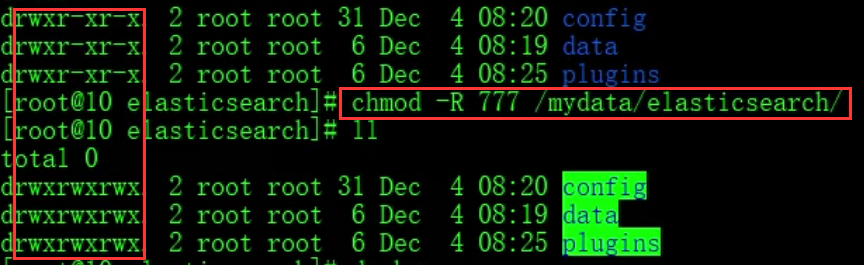

### 1.1.指定一个更大内存的es

```properties
注：
	移除老的容器数据不会遗失，因为挂载了本地目录，当启动新的容器时挂在到相同目录下即可
```

```sh
1.停止已启动的es容器
docker stop elasticsearch

2.删除容器
docker rm elasticsearch

3.启动新容器，分配512M内存
docker run --name elasticsearch -p 9200:9200 -p9300:9300 \
-e "discovery.type=single-node" \
-e ES_JAVA_OPTS="-Xms64m -Xmx512m" \
-v /mydata/elasticsearch/config/elasticsearch.yml:/usr/share/elasticsearch/config/elasticsearch.yml \
-v /mydata/elasticsearch/data:/usr/share/elasticsearch/data \
-v /mydata/elasticsearch/plugins:/usr/share/elasticsearch/plugins \
-d elasticsearch:7.4.2

4.自动启动
docker update elasticsearch --restart=always

5.重启
docker restart elasticsearch
```


## 2.安装Kibana（可视化检索数据）

```sh
1、下载镜像文件
docker pull kibana:7.4.2

2.根据镜像启动一个容器
	1）-e elasticsearch.url 表示设置启动参数，主机地址
	2）-p 端口映射
	3）-d 使用的镜像
docker run --name kibana -e ELASTICSEARCH_URL=http://192.168.56.10:9200 -p 5601:5601 \
-d kibana:7.4.2
【步骤2正确语句写法：以上写法是为了演示步骤4解决异常
docker run --name kibana -e ELASTICSEARCH_HOSTS=http://192.168.56.10:9200 -p 5601:5601 \
-d kibana:7.4.2】


3.访问192.168.56.10:5601
Kibana server is not ready yet

4.解决异常【docker run语句】
	1）docker logs 容器ID
	2）docker exec -it kibana /bin/bash
	3）vi /usr/share/kibana/config/kibana.yml
	修改 elasticsearch.hosts: [ "http://192.168.56.10:9200" ]

5.修改kibana为中文
	1）docker exec -it kibana /bin/bash
	2）vi /usr/share/kibana/config/kibana.yml
	3）增加以下配置：
	i18n.locale: "zh-CN"

6.docker update kibana --restart=always

7.docker restart kibana
```

## 3.安装ik分词器

```
1.下载对应版本分词器
选择对应es版本安装：https://github.com/medcl/elasticsearch-analysis-ik/releases?after=v7.6.0
下载7.4.2
不能使用默认 elasticsearch-plugin install xxx.zip
2、具体步骤
	1）docker exec -it elasticsearch /bin/bash【可以直接在外部挂载的文件夹下】
		cd /mydata/elasticsearch/plugins
	2）安装wget
		yum install wget
	3）wget https://github.com/medcl/elasticsearch-analysis-ik/releases/download/v7.4.2/elasticsearch-analysis-ik-7.4.2.zip
	4）创建ik文件夹，解压： unzip 
	5）rm -rf *.zip
	6）修改权限 chmod -R 777 ik/
	7）检查ik是否装好：docker exec -it elasticsearch /bin/bash
					cd /bin
	8）重启elasticsearch
```

ik分词器安装地址： [elasticsearch-analysis-ik-7.4.2.zip](https://github.com/medcl/elasticsearch-analysis-ik/releases/download/v7.4.2/elasticsearch-analysis-ik-7.4.2.zip)

